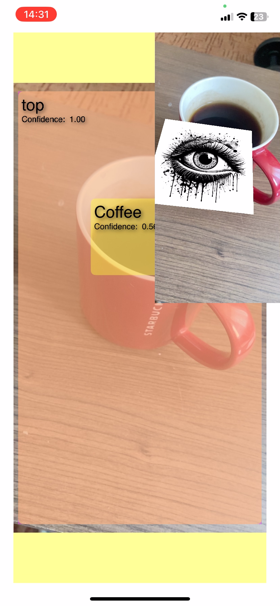
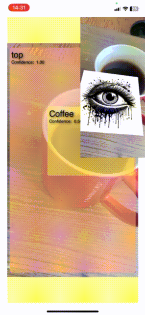

# AR Object Recognition

An iOS application that combines ARKit, Vision, and Core ML to detect, recognize and track objects in the real world, and display AR content on top of recognized objects.

## Overview

This application uses Apple's Vision framework alongside ARKit to:

1. Recognize objects in the device's camera feed using a custom-trained Core ML model
2. Track detected objects through space
3. Display augmented reality content (images or 3D models) on top of the detected objects

The application works by:
- Setting up an AR session with SceneKit
- Processing camera frames to detect objects using Vision and Core ML
- Drawing a detection overlay to visualize recognized objects
- Positioning AR content at the location of detected objects using raycasting

## Requirements

- iOS 15.0+
- Xcode 13.0+
- Device with ARKit support (iPhone 6s or newer)
- Core ML model for object detection ("ObjectDetector.mlmodelc")

## Features

### Vision Object Recognition
- Uses Vision framework for object detection and classification
- Supports custom-trained Core ML models
- Configurable confidence threshold (currently set to 0.95)

### Object Tracking
- Tracks detected objects between frames
- Maintains object identity even with temporary occlusion

### Augmented Reality Integration
- Places 3D models or images at detected object locations
- Uses ARKit raycasting to position content on real-world surfaces
- Supports both flat images and 3D models (USDZ format)

### Visualization
- Displays detection rectangles with labels and confidence scores
- Optional debug visualization (controlled via `showLayers` flag)

## Integration

The main components of the application are:

1. `VisionObjectRecognitionViewController` - Main controller integrating Vision and ARKit
2. `ARSCNView` - SceneKit view for rendering AR content
3. Core ML model - Custom-trained model for object detection

## Usage

1. Launch the application on a supported iOS device
2. Point the camera at objects you want to detect
3. When the model recognizes an object with high confidence, it will display:
   - A bounding box around the object
   - A label with the object name and confidence score
   - AR content (image or 3D model) anchored to the object

## Customization

### Changing the Detection Model
Replace the "ObjectDetector.mlmodelc" with your own Core ML model:

```swift
guard let modelURL = Bundle.main.url(forResource: "YourModelName", withExtension: "mlmodelc") else {
    return NSError(domain: "VisionObjectRecognitionViewController", code: -1, userInfo: [NSLocalizedDescriptionKey: "Model file is missing"])
}
```

### Adjusting Confidence Threshold
Modify the confidence threshold in the `drawVisionRequestResults` method:

```swift
if topLabelObservation.confidence < 0.80 { // Lower threshold for more detections
    continue
}
```

### Changing AR Content
To display different AR content, modify the `show3DModel` method:

For 3D models:
```swift
guard let urlPath = Bundle.main.url(forResource: "your_model", withExtension: "usdz") else {
    return nil
}
```

For images:
```swift
node = createARNodeWith(image: UIImage(named: "your_image")!, size: CGSizeMake(0.1, 0.1))
```

## Notes

- The application performs best in well-lit environments
- The detection accuracy depends on the quality of the Core ML model
- ARKit requires surfaces with sufficient visual features for optimal tracking
- Performance may vary depending on the device's processing capabilities

## License

See the LICENSE.txt file for this sample's licensing information.
